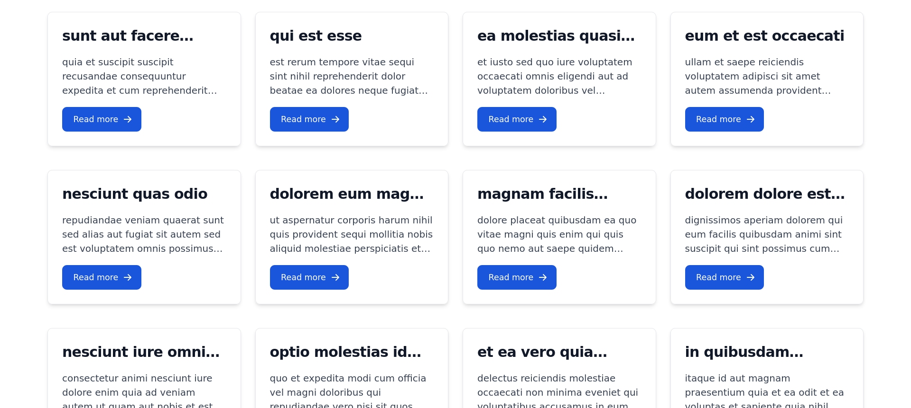
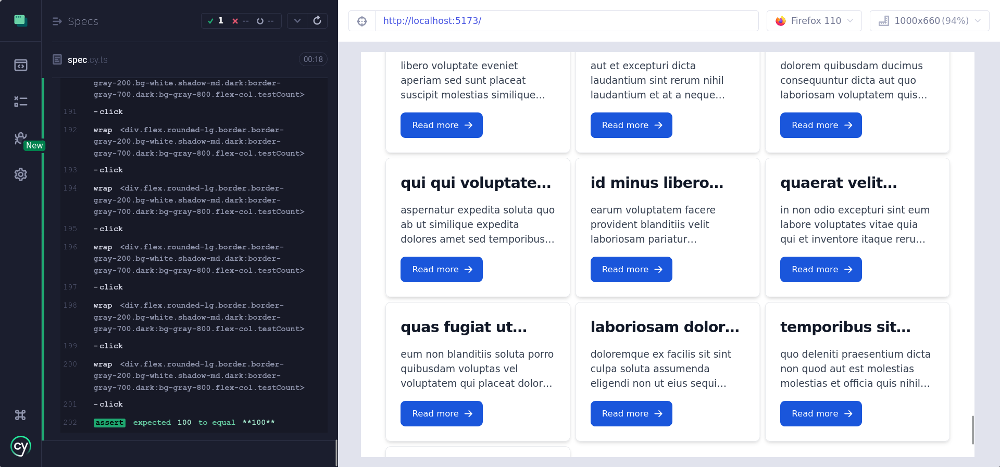

<div align="center">

  <h1>Young-Coders-Unit-Testing-Case</h1>

<br />

<!-- Table of Contents -->

# :notebook_with_decorative_cover: Table of Contents

 [Screenshots](#camera-screenshots)
  - [Tech Stack](#space_invader-tech-stack)
- [Getting Started](#toolbox-getting-started)
  - [Prerequisites](#bangbang-prerequisites)
  - [Installation](#gear-installation)
  - [Run Locally](#running-run-locally)
  - [Deployment](#triangular_flag_on_post-deployment)
- [Usage](#eyes-usage)
- [Roadmap](#compass-roadmap)
- [Contact](#handshake-contact)


<!-- Screenshots -->

### :camera: Screenshots

<div align="center">
  
  

</div>

<!-- TechStack -->

### :space_invader: Tech Stack

<details>
  <summary>Client</summary>
  <ul>
    <li><a href="https://www.typescriptlang.org/">Typescript</a></li>
    <li><a href="https://reactjs.org/">React.js</a></li>
    <li><a href="https://tailwindcss.com/">TailwindCSS</a></li>
  </ul>
</details>


<!-- Getting Started -->

## :toolbox: Getting Started

<!-- Prerequisites -->

### :bangbang: Prerequisites

<!-- Installation -->

### :gear: Installation

Install my-project with npm

```bash
  npm install my-project
  cd my-project
```

<!-- Run Locally -->

### :running: Run Locally

Clone the project

```bash
  git clone https://github.com/doandroidsdreamof/havas-unit-testing-case-study.git
```

Go to the project directory

```bash
  cd my-project
```

Install dependencies

```bash
  npm install
```

Start the server

```bash
  npm run dev
```

Unit testing

```bash
  npm run test:units
```

E2E testing

```bash
  npm run cypress:open
```

<!-- Deployment -->

### :triangular_flag_on_post: Deployment

To deploy this project run

```bash
  npm deploy
```

<!-- Usage -->

## :eyes: Usage

### recommended vscode extension

```

Better Comments
https://marketplace.visualstudio.com/items?itemName=aaron-bond.better-comments

```

### comment structure

```javascript
//? => imports
//! => important
//* => notes && refactoring todos
```

<!-- Roadmap -->

## :compass: Roadmap

- [x] Post Component
- [x] Dark Mode
- [x] Routing
- [x] Responsive Layout
- [x] E2E Testing
- [x] Unit Testing

<!-- Acknowledgments -->

## :gem: Acknowledgements

Use this section to mention useful resources and libraries that you have used in your projects.

- [Shields.io](https://shields.io/)
- [Awesome README](https://github.com/matiassingers/awesome-readme)
- [Emoji Cheat Sheet](https://github.com/ikatyang/emoji-cheat-sheet/blob/master/README.md#travel--places)
- [Readme Template](https://github.com/othneildrew/Best-README-Template)
